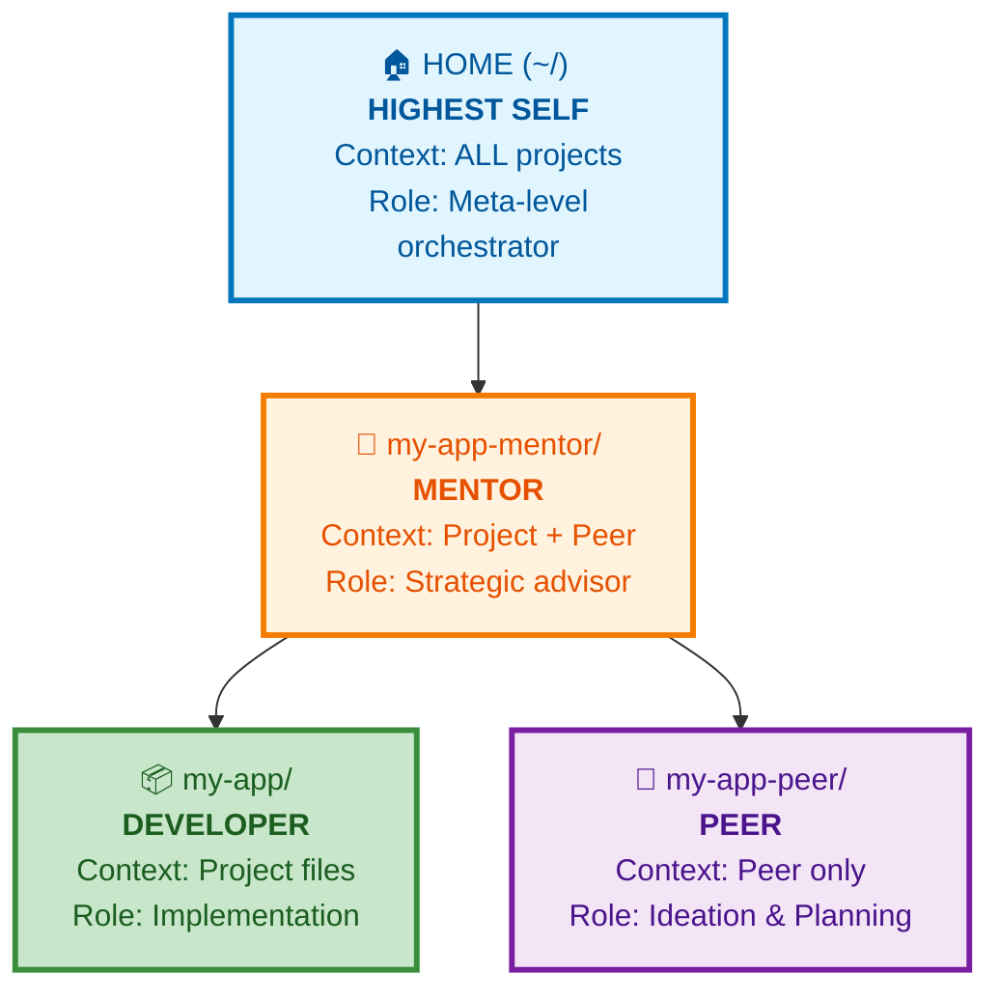

# The Four Minds Pattern

> A workflow architecture for AI-assisted development that decomposes **cognitive roles** instead of tasks — and that evolved, under production pressure, into **verified delegation**: a mentor instance that dispatches headless builders directly and trusts nothing it can't verify.

**Status:** Public Release | **License:** MIT | **Author:** Marty Bonacci

---

## What Is This?

The Four Minds Pattern started as a simple idea: instead of one AI assistant that context-switches between strategic planning, brainstorming, and execution, run **multiple specialized AI instances at different directory hierarchy levels** — each with a distinct cognitive role and a context scope to match.

That original pattern (v1) is documented below as the origin story. It worked — and then it evolved.

Over ~7 weeks of production use on a real project (June–July 2026), the pattern's human-relay step disappeared: the Mentor instance began dispatching a headless builder **directly**, running **498 audited dispatches** and hardening the loop through real incidents. The current form of the pattern — **v2, verified delegation** — is what most of this document is about.

**This isn't about coding faster. It's about thinking better — and verifying harder.**

---

## The Original Pattern (v1): Four Minds, Four Directories

### The Problem

Most developers use AI coding assistants like this:

```
~/my-project/ $ claude
> "Help me build a user authentication system"
> "Actually, let me try a different approach..."
> "Wait, how should I structure this?"
> "Okay, now implement it for real"
```

- 🔄 Constant context switching between strategic thinking and execution
- 💭 Ideation and planning mix with implementation, creating cognitive friction
- 🤔 No dedicated space for meta-level thinking about workflows
- 📊 A single AI sees everything but can't maintain distinct perspectives

### The Solution: Four Minds


```mermaid
graph TD
    HOME["🏠 HOME (~/) <br/> <b>HIGHEST SELF</b> <br/> Context: ALL projects <br/> Role: Meta-level orchestrator"]

    MENTOR["📂 my-app-mentor/ <br/> <b>MENTOR</b> <br/> Context: Project + Peer <br/> Role: Strategic advisor"]

    PROJECT["📦 my-app/ <br/> <b>DEVELOPER</b> <br/> Context: Project files <br/> Role: Implementation"]

    PEER["💭 my-app-peer/ <br/> <b>PEER</b> <br/> Context: Peer only <br/> Role: Ideation & Planning"]

    HOME --> MENTOR
    MENTOR --> PROJECT
    MENTOR --> PEER

    style HOME fill:#e1f5fe,stroke:#0277bd,stroke-width:3px,color:#01579b
    style MENTOR fill:#fff3e0,stroke:#f57c00,stroke-width:3px,color:#e65100
    style PROJECT fill:#c8e6c9,stroke:#388e3c,stroke-width:3px,color:#1b5e20
    style PEER fill:#f3e5f5,stroke:#7b1fa2,stroke-width:3px,color:#4a148c
```

1. **Developer** (`my-app/`) — implementation and execution, sees only the project.
2. **Peer** (`my-app-peer/`) — conversational ideation and planning; creates `.md` artifacts, not code.
3. **Mentor** (`my-app-mentor/`) — strategic advisor; sees both the project and the ideation artifacts.
4. **Highest Self** (`~/`) — meta-level workflow advisor; sees all projects and all tooling.

**Directory hierarchy = cognitive hierarchy.** Higher directories have broader context for strategic thinking; lower directories have focused context for execution. The physical separation enforces the cognitive separation.

### v1's Favorite Workflow: Mentor → Developer Prompting

Ask the Mentor:

> "Given the available tools, commands, skills, agents and other helpful resources and the current state of [developer/project], please help me make a prompt or series of prompts to give the instance currently open in [developer/project] to prompt it to make [feature]."

The Mentor crafts a strategic, context-aware prompt. **You copy it** into the Developer terminal. The Developer executes with clear direction.

That copy step — the human as relay — is where v1 ended and v2 began.

For the full v1 documentation, see the [Workflow Guide](docs/workflow-guide.md), [Mentor→Developer Workflow](docs/mentor-developer-workflow.md), and [Why This Works](docs/why-this-works.md).

---

## How the Pattern Evolved (v2): Verified Delegation

In June 2026, on a production project, the human relay step was removed. The Mentor session began invoking a headless builder directly:

```
mentor session ──► dispatch.sh ──► claude --print (headless builder, in my-app/)
       ▲                                    │
       └──── independent verification ◄────┘
             (git diff, re-run gates, commit-hash checks)
```

Over the following ~7 weeks this loop ran **498 audited dispatches** (162 in June, 332 in July, the remainder in early August), totaling **32,801 builder turns** at a sustained pace of **~6 dispatches per day** — roughly **$4,468 in notional API cost** (actual cost: $0 on a subscription plan; the real constraint is usage limits, not dollars).

Removing the relay didn't just save copy-paste time. It forced three role redefinitions that turned out to be the actual pattern. These are the thesis of v2:

### Claim 1 — The mentor's job is verification, not prompting

When the mentor could no longer watch the builder work, "trust but verify" collapsed into just **verify**. The measured ratio settled at **~9–10 independent verification commands per builder dispatch**: reading the actual `git diff`, re-running the test gates itself, checking that claimed commit hashes exist in the tree.

**"Never trust the builder's self-report"** is not a slogan — it's enforced by protocol, and it caught real failures. In one incident, a builder finished every task, wrote a detailed all-green report ("exactly the intended files… everything green"), and exited with **the entire diff uncommitted**. The tell: the report listed files but no commit hashes, and `git log <base>..HEAD` printed empty while the gates passed. A mentor that trusted reports would have shipped nothing and believed otherwise.

Prompt-crafting is still part of the job. But the mentor's *irreplaceable* job is being the adversarial auditor of a worker it cannot see.

### Claim 2 — The human's job is being the sole sighted oracle, plus taste

In v2 the human **never reads code**. Their role collapses to four things:

1. **Drive the running app** and report what they see and feel — the only truly sighted actor in the loop.
2. **Answer batched decision sheets** — open questions accumulate and are presented in one batch, not as interruptions.
3. **Bless ships** — final authorization on what merges.
4. **Own credentials and accounts** — the things an AI shouldn't hold.

Measured result: **~4 human touches per feature, down from ~25** under the copy-paste relay pattern. The human's steps are the latency bottleneck; every touch moved off their critical path is cycle time recovered. An [escalation boundary](templates/escalation-boundary.md) makes this structural: mechanical questions self-resolve, verification questions go to a fresh-context advisor agent, and only genuine human judgment — risk acceptance, product taste, scope tradeoffs — reaches the human, as one well-formed message with options and a recommendation.

### Claim 3 — Every incident becomes a standing rule

Headless builders fail in **enumerable** ways. Over 498 dispatches, six distinct failure modes appeared:

1. **Timeout mid-task** — killed with work uncommitted in the tree
2. **API connection death** — truncated output, partial files
3. **Yield-await** — the builder backgrounds its own gates and ends its turn "awaiting completion"; headless runs get no later turns, so it silently did nothing
4. **Zombie survives timeout** — the killed builder's child processes keep mutating the repo and race the *next* dispatch
5. **Verified-but-uncommitted clean exit** — all work done, gates green, full report written, nothing committed
6. **Killed mid-checkout** — the shared tree left in detached HEAD, so every subsequent gate run silently tests the wrong code

Each mode got a documented tell and a recovery protocol, and each recovery protocol *changed the standing infrastructure or prompt template* so the next occurrence is caught mechanically. **7 out of 7 recoveries succeeded**, for one reason: **git commits are the durable record.** Every interruption left committed work intact, and a resume dispatch that starts from `git status` always found the work still in the tree.

The full catalog — tells, recoveries, and the prompt clauses that pre-empt each mode — is in [docs/failure-modes.md](docs/failure-modes.md).

---

## The v2 Loop, Concretely

Per feature chunk:

```
brainstorm → batched human decisions → spec → plan → tasks
    → dispatch builder (implement)
    → mentor independent verify (diff + gates + commit hashes)
    → adversarial review pass on the diff (fresh-context agent)
    → human sighted gate (drive the app, report taste)
    → ship dispatch (gates + merge + tag)
```

Four mechanisms make it work, and all four are in [`templates/`](templates/) for you to steal:

| Mechanism | File | What it does |
|---|---|---|
| **Dispatch wrapper** | [`templates/dispatch.sh`](templates/dispatch.sh) | Wraps `claude --print` with per-tree locks, process-group timeout kill, survivor sweep, and full audit capture of every run |
| **Kickoff ritual** | [`templates/MENTOR-KICKOFF.md`](templates/MENTOR-KICKOFF.md) | Re-establishes the mentor role as a *user* instruction after every context reset — without it, the mentor drifts back into implementing directly |
| **Escalation boundary** | [`templates/escalation-boundary.md`](templates/escalation-boundary.md) | Three lanes: self-resolve / advisor agent / human — keeps the human off the critical path except for genuine judgment |
| **Parking lot** | [`templates/PARKING-LOT.md`](templates/PARKING-LOT.md) | Zero-ceremony idea capture: the human's mid-flow ideas get recorded near-verbatim and triaged later, instead of derailing the live thread |

What stayed the same from v1: the directory hierarchy, the role separation, and the core insight that **the mentor level exists to think about the work rather than do it**. The builder is v1's Developer made headless; the Peer's ideation function largely migrated into the parking lot and spec/brainstorm phases; the Highest Self still operates above it all (this repo's evolution was itself steered from there).

---

## Honest Tradeoffs

This section is mandatory reading before you adopt v2. The pattern works, but it is not free.

### `bypassPermissions` is a real risk

Headless builders need to commit, branch, run package managers, and touch databases without a human at the keyboard. In practice that means running with permission checks bypassed (`--permission-mode bypassPermissions`); edit-only approval modes gate the git operations builders need. You are giving an unattended AI process full write access to a repo and its toolchain. Mitigations used here — a dedicated builder directory, all writes routed through git (recoverable), locks preventing concurrent mutation, and an audit record of every run — reduce but do not eliminate the risk. Do not point this at a tree containing anything you can't afford to lose, and keep the builder off production credentials entirely.

### Model pinning is required, and it costs you

A headless invocation can inherit the interactive session's roaming model default — including models that aren't accessible headless, which fails in confusing ways. The dispatch wrapper **pins the builder model explicitly**. Consequence: your builder doesn't automatically ride model upgrades; revisiting the pin is a manual chore.

### The cost profile is subscription-shaped

~$4,468 notional API cost over 7 weeks was $0 actual on a subscription plan — but that means the binding constraint is **usage limits, not dollars**. A usage-window kill mid-dispatch is just another failure mode (the recovery is the standard checklist plus a verbatim relaunch after the window resets). On pay-per-token API pricing, this pattern has a real bill; measure your own ratio before committing to it.

### The failure-mode catalog is a load-bearing dependency

The loop is reliable *because* six failure modes were observed, named, and given recovery protocols. Adopting the dispatch script without adopting the [failure-mode discipline](docs/failure-modes.md) gets you the failures without the recoveries. Expect to extend the catalog with modes specific to your stack.

### Verification discipline decays silently

The ~9–10 verifications per dispatch is the pattern. Nothing *forces* the mentor to keep doing it — and every skipped verification looks free until the day a green report covers an empty tree. If the mentor stops re-running gates itself, stops checking commit hashes, stops reading diffs, the loop keeps "working" while quietly becoming trust-based. The kickoff ritual exists precisely because this drift is the default; re-read it after every context reset.

### Tool coupling

v1 is tool-agnostic (any assistant with multiple instances and directory-scoped context). v2 as templated here depends on a CLI assistant with a non-interactive print mode, JSON output, resumable sessions, and permission-mode flags — i.e., it's verified with Claude Code specifically. Porting to another tool means porting those four capabilities.

---

## Quick Start

### v1 (four interactive terminals)

```bash
~/code-projects/my-app-mentor/
├── my-app/              # Your actual project (Developer)
└── my-app-peer/         # Planning & ideation space (Peer)
```

```bash
# Terminal 1: Highest Self
cd ~/ && claude -c --permission-mode plan

# Terminal 2: Mentor
cd ~/code-projects/my-app-mentor/ && claude -c --permission-mode plan

# Terminal 3: Peer
cd ~/code-projects/my-app-mentor/my-app-peer/ && claude -c --permission-mode plan

# Terminal 4: Developer
cd ~/code-projects/my-app-mentor/my-app/ && claude
```

Start here if you're new to the pattern. The relay step (you copying Mentor's prompts to Developer) is a feature at this stage — you see every prompt and every result, which is exactly the calibration you need before removing yourself from the loop.

### v2 (verified delegation)

1. Copy [`templates/dispatch.sh`](templates/dispatch.sh) into your mentor directory, set the builder path and model at the top, `chmod +x` it.
2. Adapt [`templates/MENTOR-KICKOFF.md`](templates/MENTOR-KICKOFF.md) to your project; paste it as the first message of every mentor session.
3. Adopt [`templates/escalation-boundary.md`](templates/escalation-boundary.md) and [`templates/PARKING-LOT.md`](templates/PARKING-LOT.md) as standing process files the mentor can read.
4. Read [docs/failure-modes.md](docs/failure-modes.md) *before* your first dispatch, not after your first incident.
5. Start with short, well-specified dispatches and verify everything. Earn your way to longer ones.

**Graduate from v1 to v2 when:** you notice the Mentor's prompts are good enough that you're pasting them verbatim without edits. At that point you are a relay, and the relay can be automated — what can't be automated is your eyes and your taste.

---

## When to Use Each Mind (v2 edition)

| Situation | Who handles it |
|---|---|
| "Implement the login form" | Mentor dispatches the builder |
| "Is the builder's work actually done?" | Mentor verifies independently (never the builder's word) |
| "Does this gate really pass?" | Advisor agent (fresh context, read-only, adversarial) |
| "Does the new flow feel right?" | Human, driving the running app |
| "Ship it?" | Human blesses; mentor runs the ship dispatch |
| "I just had an idea mid-build" | Parking lot — captured verbatim, triaged later |
| "How should this whole workflow improve?" | Highest Self |

---

## Beyond Software Development

Four Minds is a cognitive pattern, not a software pattern. The separation of execution, exploration, strategy, and meta-reflection applies to any creative or intellectual work — writing, content, strategy, research. And v2's core discovery generalizes too: **when you delegate to a worker you cannot watch, your role shifts from directing the work to verifying it, and the scarce human input becomes judgment, not effort.**

See [Applications Beyond Code](docs/applications-beyond-code.md).

---

## Documentation

- [Failure Modes & Recovery Protocols](docs/failure-modes.md) — **the v2 incident catalog**
- [Templates](templates/) — dispatch wrapper, kickoff ritual, escalation boundary, parking lot
- [Why This Works](docs/why-this-works.md) — cognitive science explanation (v1)
- [Workflow Guide](docs/workflow-guide.md) — detailed workflows for each Mind (v1)
- [Mentor→Developer Workflow](docs/mentor-developer-workflow.md) — the prompt crafting pattern (v1, the precursor to dispatch)
- [Lessons from Practice](docs/lessons-from-practice.md) — what extended use of the Mentor→Developer pattern revealed about its lifecycle
- [Applications Beyond Code](docs/applications-beyond-code.md)
- [Troubleshooting](docs/troubleshooting.md)
- [Visual Diagrams](docs/four-minds-diagram.md) · [Mermaid sources](assets/diagrams/)

---

## Research & Background

The original pattern emerged from analyzing multi-agent AI systems and identifying a gap: task-based orchestration patterns are well documented; **cognitive role-based orchestration** for enhanced human decision-making was not. v2 adds an empirical claim to that: with verification discipline and a failure-mode catalog, the strategic layer can safely *operate* the execution layer directly — the human relay is not what made the pattern safe; the verification was.

See [Research Notes](docs/research-notes.md).

---

## Contributing

Contributions are welcome — issues, discussions, and pull requests. Reports from running the pattern on other AI tooling are especially valuable.

---

## License

MIT License — Copyright (c) 2024 Marty Bonacci. See [LICENSE](LICENSE).

---

## Author

**Marty Bonacci**
- Senior Developer & Coding Bootcamp Instructor
- Pattern Discoverer: The Four Minds Pattern
- Creator: [SpecSwarm](https://github.com/MartyBonacci/specswarm)

---

## Acknowledgments

- **Anthropic** for Claude and Claude Code
- **Fareed Khan** for [Agentic Parallelism](https://github.com/FareedKhan-dev/agentic-parallelism) research
- **LangChain/LangGraph** teams for multi-agent framework foundations
- The broader AI coding tools community

---

**Status:** Original pattern published November 2024 · Verified-delegation evolution (v2) documented August 2026, from 498 audited production dispatches.
