# The Four Minds Pattern

> A novel agentic orchestration pattern for AI-assisted development that uses cognitive role decomposition instead of task decomposition.

**Status:** Public Release | **License:** MIT | **Author:** Marty Bonacci

---

## What Is This?

The Four Minds Pattern is a workflow architecture for AI coding assistants (Claude Code, Codex, Gemini, Qwen Code, etc.) that fundamentally changes how you think about AI-assisted development.

Instead of using a single AI instance that context-switches between strategic planning, conversational ideation, and execution, you run **four specialized AI instances** at different directory hierarchy levels—each serving a distinct cognitive role.

**This isn't about coding faster. It's about thinking better.**

---

## The Problem

Most developers use AI coding assistants like this:

```
~/my-project/ $ claude-code
> "Help me build a user authentication system"
> "Actually, let me try a different approach..."
> "Wait, how should I structure this?"
> "Let me think through this idea more..."
> "Okay, now implement it for real"
```

**Problems:**
- 🔄 Constant context switching between strategic thinking and execution
- 💭 Ideation and planning mix with implementation, creating cognitive friction
- 🤔 No dedicated space for meta-level thinking about workflows
- 📊 Single AI sees everything but can't maintain distinct perspectives

---

## The Solution: Four Minds

```mermaid
graph TD
    HOME["🏠 HOME (~/) <br/> <b>HIGHEST SELF</b> <br/> Context: ALL projects <br/> Role: Meta-level orchestrator"]

    MENTOR["📂 my-app-mentor/ <br/> <b>MENTOR</b> <br/> Context: Project + Peer <br/> Role: Strategic advisor"]

    PROJECT["📦 my-app/ <br/> <b>DEVELOPER</b> <br/> Context: Project files <br/> Role: Implementation"]

    PEER["💭 my-app-peer/ <br/> <b>PEER</b> <br/> Context: Peer only <br/> Role: Ideation & Planning"]

    HOME --> MENTOR
    MENTOR --> PROJECT
    MENTOR --> PEER

    style HOME fill:#e1f5fe,stroke:#0277bd,stroke-width:3px,color:#01579b
    style MENTOR fill:#fff3e0,stroke:#f57c00,stroke-width:3px,color:#e65100
    style PROJECT fill:#c8e6c9,stroke:#388e3c,stroke-width:3px,color:#1b5e20
    style PEER fill:#f3e5f5,stroke:#7b1fa2,stroke-width:3px,color:#4a148c
```



### The Four Minds

Let's explore each Mind, starting with the most familiar and building up to the meta-level orchestrator.

#### 1. **Developer** (Project Directory)

- **Location:** The actual project directory within mentor (e.g., `~/code-projects/my-app-mentor/my-app/`)
- **Role:** Implementation and execution
- **Context:** Full project file context
- **Purpose:** Write code, execute tasks, direct development work
- **When to use:** Actual implementation, code reviews, debugging

#### 2. **Peer** (Peer Directory)

- **Location:** Sibling to project within mentor directory (e.g., `~/code-projects/my-app-mentor/my-app-peer/`)
- **Role:** Conversational brainstorming partner and sounding board
- **Context:** Peer directory, can request permission to view sibling project/ directory
- **Purpose:** Conversational ideation and brainstorming; safe space to explore ideas without commitment
- **When to use:** Talking through possibilities, exploring approaches, private planning, conversational exploration
- **Note:** Peer creates planning and ideation documents (.md files), not code. Even technical discussions result in documented evaluations, not code prototypes.

#### 3. **Mentor** (Project-Mentor Directory)

- **Location:** Project-specific mentor directory (e.g., `~/code-projects/my-app-mentor/`)
- **Role:** Strategic advisor with visibility into both execution and ideation
- **Context:** Both project/ AND project-peer/ subdirectories within the mentor directory
- **Purpose:** Crafts prompts for Developer, coordinates between execution and ideation
- **When to use:** Strategic planning, prompt engineering for Developer, architectural decisions

#### 4. **Highest Self** (~/)

- **Location:** Home directory
- **Role:** Workflow evolution partner and meta-development advisor
- **Context:** All projects, all .claude directories, all plugins/commands/skills
- **Purpose:** Guides mastery of Claude Code itself and evolution of your development practice
- **When to use:** Improving workflows, building Claude Code tools, recognizing cross-project patterns, reflecting on development practice
- **Note:** Conversations with Highest Self led to the creation of SpecSwarm, ConvoSync, and this Four Minds Pattern itself

---

## Why This Works

Traditional multi-agent patterns decompose **tasks** for speed. Four Minds decomposes **cognitive roles** for better thinking.

Each Mind operates at a different directory level, giving it unique context and perspective:
- **Highest Self** sees all projects → cross-project pattern recognition
- **Mentor** sees project + ideation artifacts → strategic decision-making
- **Peer** sees only ideation space → unconstrained creative thinking
- **Developer** sees only project → focused execution

This isn't about coding faster. **It's about thinking better.**

For detailed cognitive science explanation, see [Why This Works](docs/why-this-works.md).

### What Each Mind Gives You

While the pattern as a whole improves thinking quality, **each Mind solves a specific problem:**

#### Peer: Safe Brainstorming Partner

- **Problem Solved:** Commitment anxiety kills exploration
- **Benefit:** Unconstrained ideation without worrying about git history, implementation constraints, or "wasting time"
- **Result:** Better ideas through freedom to explore without consequences

#### Mentor: Strategic Prompt Crafting

- **Problem Solved:** Vague prompts lead to misaligned implementations
- **Benefit:** Context-aware instructions that align with your codebase patterns and goals
- **Result:** Developer executes exactly what you need, first time

#### Developer: Focused Execution

- **Problem Solved:** Strategic thinking interrupts implementation flow
- **Benefit:** Pure execution mode without strategic decision-making burden
- **Result:** Faster, cleaner implementation with full project context

#### Highest Self: Workflow Evolution Partner

- **Problem Solved:** No reflection on how you work leads to repeated inefficiencies
- **Benefit:** Meta-level insights about your development practice and Claude Code usage
- **Result:** Continuous workflow improvement and tool innovation (SpecSwarm, ConvoSync, Four Minds itself emerged from Highest Self conversations)

**The compound effect:** Each Mind's benefit amplifies the others. Peer's exploration informs Mentor's strategy, Mentor's prompts optimize Developer's execution, and Highest Self improves how all three work together.

---

## Quick Start

### Prerequisites

- AI coding assistant (Claude Code, Cursor, Aider, etc.)
- Multiple terminal windows
- Basic understanding of directory hierarchies

### Setup

1. **Create directory structure:**
```bash
~/code-projects/my-app-mentor/
├── my-app/              # Your actual project (Developer)
└── my-app-peer/         # Planning & ideation space (Peer)
```

2. **Launch four instances:**
```bash
# Terminal 1: Highest Self
cd ~/
claude-code -c --plan

# Terminal 2: Mentor
cd ~/code-projects/my-app-mentor/
claude-code -c --plan

# Terminal 3: Peer
cd ~/code-projects/my-app-mentor/my-app-peer/
claude-code -c --plan

# Terminal 4: Developer
cd ~/code-projects/my-app-mentor/my-app/
claude-code
```

3. **Use the pattern:**
- Ask **Mentor** to craft prompts for **Developer**
- Ask **Peer** to brainstorm approaches
- Ask **Developer** to implement
- Ask **Highest Self** for workflow guidance

---

## Favorite Workflow: Mentor → Developer Prompting

The most powerful pattern discovered:

**Ask Mentor:**
> "Given the available tools, commands, skills, agents and other helpful resources and the current state of [developer/project], please help me make a prompt or series of prompts to give the Claude Code instance currently open in [developer/project] to prompt it to make [next super awesome feature]."

**Mentor crafts** a strategic, well-informed prompt.

**You copy** the prompt to Developer.

**Developer executes** with clear direction.

**Why this works:**
- Mentor sees the full picture (both project/ and project-peer/ subdirectories)
- Mentor has time to think strategically (plan mode)
- Developer gets clear, actionable instructions
- Separation prevents strategic confusion during execution

---

## Usage Patterns

### When to Use Each Mind

| Situation | Mind to Use | Why |
|---|---|---|
| "Implement the login form" | Developer | Execution focus |
| "Let's discuss this library..." | Peer | Safe conversational exploration |
| "Draft marketing copy" | Peer | Private, won't pollute project |
| "How should I architect this?" | Mentor | Strategic context, sees alternatives |
| "What's the best way to prompt Developer?" | Mentor | Understands both context and goals |
| "How do I develop Claude Code plugins?" | Highest Self | Meta-level workflow knowledge |

### Common Flags

- **`-c` (continue)**: Almost always used for Highest Self, Mentor, and Peer to preserve conversation context
- **`--plan`**: Almost always used for Mentor and Peer to keep them in advisory mode

---

## Tool Compatibility

The Four Minds Pattern is **tool-agnostic**.

**Verified:** Claude Code
**Should work with:** Cursor, Aider, Continue.dev, Cody, Windsurf

**Requirements:**
- Multiple instance support
- Directory-based context
- Terminal access

If your AI coding tool meets these requirements, Four Minds will work.

---

## Adoption Paths: Start Where It Helps Most

**You don't need to adopt all four Minds at once.** Start with your current pain point and expand as you discover value.

### Entry Point #1: Ideation Mixing with Implementation
→ **Start with Peer only**

- **Setup:** Create `my-app-peer/` sibling directory to your project
- **Usage:** Use Peer for discussing approaches, evaluating options, drafting planning docs
- **Benefit:** Clean separation between "thinking through it" and "building it"

```bash
cd ~/code-projects/
mkdir my-app-peer
cd my-app-peer
claude-code -c --plan
```

**When to expand:** When you want strategic guidance on which ideas to implement → add Mentor

---

### Entry Point #2: AI Gives Implementations That Don't Match Your Project
→ **Start with Mentor→Developer workflow**

**Setup:** Create `my-app-mentor/` parent directory containing your project
**Usage:** Ask Mentor to craft strategic prompts, paste to Developer
**Benefit:** Developer gets context-aware instructions that align with your codebase

```bash
cd ~/code-projects/
mkdir my-app-mentor
mv my-app my-app-mentor/  # move existing project inside
cd my-app-mentor
claude-code -c --plan  # Mentor terminal
# In another terminal:
cd my-app-mentor/my-app
claude-code  # Developer terminal
```

**When to expand:** When you want to think through alternatives before committing → add Peer

---

### Entry Point #3: Repeating Mistakes Across Projects
→ **Start with Highest Self**

**Setup:** Run Claude Code from home directory
**Usage:** Ask about patterns across your projects, get workflow advice
**Benefit:** Cross-project learning and meta-level workflow optimization

```bash
cd ~/
claude-code -c --plan
```

Ask questions like:
- "What testing frameworks have worked well in my previous projects?"
- "I keep running into [problem]. What pattern should I adopt?"
- "How can I improve my development workflow?"

**When to expand:** When you want project-specific strategic guidance → add Mentor for that project

---

### Entry Point #4: Constant Context Switching Kills Productivity
→ **Adopt full Four Minds pattern**

**Setup:** Full directory structure with all four terminals (see Quick Start above)
**Usage:** Each Mind handles its cognitive role
**Benefit:** Complete separation of strategic thinking, conversational ideation, and execution

---

### Recommended Progression

Most users naturally expand in this order:

1. **Start practical:** Peer (for ideation) OR Mentor+Developer (for better prompting)
2. **Add strategic layer:** Once comfortable, add the complementary Mind (Peer or Mentor)
3. **Add meta-level:** When workflow questions arise, start using Highest Self
4. **Reach full pattern:** Eventually all four work together as cognitive system

**Remember:** Each Mind adds value independently. The full pattern emerges when you combine them, but you don't need all four to benefit.

### "Do I need all four running simultaneously?"

**No.** Usage patterns vary:
- **Selective activation:** Open just the Minds needed for current phase
- **Simultaneous presence:** Some users keep all four in tmux for easy access
- **Project-dependent:** Simple tasks might use fewer Minds; complex strategic work uses all four

**The pattern is flexible.** Start where it helps, expand where it adds value.

---

## Beyond Software Development

While this documentation uses software development examples (they're what the pattern creator knows best), **Four Minds is a cognitive pattern, not a software pattern**.

The separation of execution, exploration, strategy, and meta-reflection applies to any creative or intellectual work:

**Documentation Development:**
- Developer = writes/edits docs
- Peer = brainstorms messaging and examples
- Mentor = ensures docs achieve communication goals
- Highest Self = advises on documentation practice itself

**Content Creation:**
- Developer = produces articles/videos/content
- Peer = explores angles and approaches
- Mentor = aligns content with strategy
- Highest Self = evolves content creation workflow

**Strategic Planning:**
- Developer = executes initiatives
- Peer = explores scenarios and options
- Mentor = crafts strategic direction
- Highest Self = reflects on planning process

**Research & Analysis:**
- Developer = conducts research
- Peer = explores hypotheses
- Mentor = frames research questions strategically
- Highest Self = improves research methodology

**The universal principle:**
Any work where you need both "do the thing" and "think about doing the thing" modes benefits from physically separating those cognitive roles.

**Why software examples?**
- Pattern creator is a developer and instructor
- Software has clear artifacts (code, tests, docs) that make examples concrete
- Claude Code is a developer tool, so primary audience is developers

But if you're a writer, strategist, researcher, or content creator working with AI assistants—this pattern works for you too. Just translate the roles to your domain.

For comprehensive examples beyond code, see [Applications Beyond Code](docs/applications-beyond-code.md).

---

## Documentation

- [Why This Works](docs/why-this-works.md) - Cognitive science explanation
- [Workflow Guide](docs/workflow-guide.md) - Detailed workflows for each Mind
- [Mentor→Developer Workflow](docs/mentor-developer-workflow.md) - The prompt crafting pattern
- [Applications Beyond Code](docs/applications-beyond-code.md) - Using Four Minds for documentation, content, strategy, and research
- [Troubleshooting](docs/troubleshooting.md) - Common issues and solutions
- [Visual Diagrams](docs/four-minds-diagram.md) - ASCII diagrams and visual representations
- [Mermaid Diagrams](assets/diagrams/) - Renderable diagrams for presentations

---

## Research & Background

This pattern emerged from analyzing multi-agent AI systems and identifying a gap: while task-based orchestration patterns are well-documented, **cognitive role-based orchestration** for enhanced human decision-making has not been.

Four Minds extends multi-agent theory by introducing cognitive-based parallelism (for decision quality) as a complement to task-based parallelism (for execution speed).

**For detailed research methodology and gap analysis, see [Research Notes](docs/research-notes.md).**

---

## Contributing

Contributions are welcome! Please feel free to submit issues, discussions, or pull requests.

To provide feedback or suggestions, please open an issue or start a discussion.

---

## License

MIT License - Copyright (c) 2024 Marty Bonacci

See [LICENSE](LICENSE) for full text.

---

## Author

**Marty Bonacci**
- Senior Developer & Coding Bootcamp Instructor
- Pattern Discoverer: The Four Minds Pattern
- Creator: [SpecSwarm](https://github.com/MartyBonacci/specswarm)

---

## Acknowledgments

- **Anthropic** for Claude and Claude Code
- **Fareed Khan** for [Agentic Parallelism](https://github.com/FareedKhan-dev/agentic-parallelism) research
- **LangChain/LangGraph** teams for multi-agent framework foundations
- The broader AI coding tools community

---

**Status:** Public release - November 2024. Documentation is actively maintained and improved based on community feedback.
